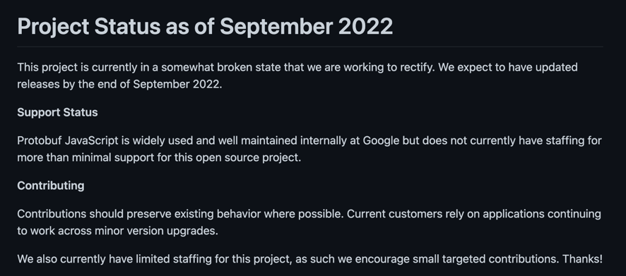
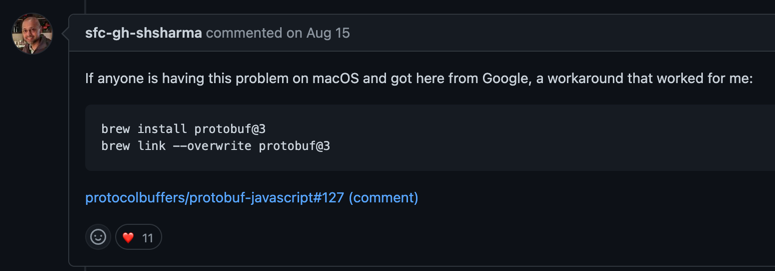
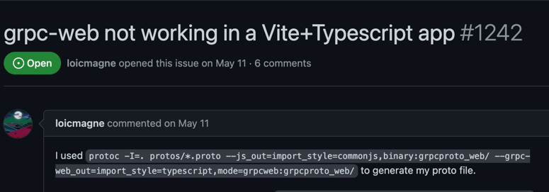

# grpc-vs-connect
This repo is used to demonstrate the tangible difference in developer experience when comparing grpc and connect. 

There are two directories:
- grpc-web:
  - grpc go application
  - envoy proxy to convert from grpc-web to grpc
  - react frontend that uses grpc-web to hit the frontend
  - protoc with a Makefile that is used to generate all the server and client stubs
  - local .proto schema, even for the client
- connect:
  - connect go backend application
  - connect-web frontend application

See the difference:
```
cloc --exclude-dir=node_modules --include-ext=go,js,ts,proto,yaml,Makefile --diff grpc connect

      32 text files.
classified 30 files
      19 text files.
classified 17 files
 1:        1 unique file.                          
 2:        2 unique files.                          
      34 files ignored.                           

github.com/AlDanial/cloc v 1.94  T=0.02 s (776.9 files/s, 136106.8 lines/s)
-------------------------------------------------------------------------------
Language                     files          blank        comment           code
-------------------------------------------------------------------------------
Go
 same                            0              0             16             42
 modified                        1              0              0             46
 added                           0              0              0             34
 removed                         2             92             65            629
JavaScript
 same                            1              2              1              7
 modified                        0              0              0              0
 added                           0              0              0              0
 removed                         2            157            516            490
TypeScript
 same                            3              2              5             14
 modified                        0              0              0              0
 added                           0              0              0              0
 removed                         4             88            122            340
YAML
 same                            0              0              0              0
 modified                        0              0              0              0
 added                           0              0              0              0
 removed                         2              1              0             67
Protocol Buffers
 same                            0              0              0              0
 modified                        0              0              0              0
 added                           0              0              0              0
 removed                         1             10             31             26
-------------------------------------------------------------------------------
SUM:
 same                            4              4             22             63
 modified                        1              0              0             46
 added                           0              0              0             34
 removed                        11            348            734           1552
-------------------------------------------------------------------------------
```


# grpc vs connect

---

# grpc

---
# protoc-gen-js

---
# protoc-gen-js

- https://github.com/grpc/grpc-web/issues/704 which is a duplicate of
- https://github.com/protocolbuffers/protobuf-javascript/issues/105 which is a duplicate of
- https://github.com/protocolbuffers/protobuf-javascript/issues/127 and the issue is to

---
# protoc-gen-js



---

# solution


---

# protoc-gen-grpc-web
- Requires envoy proxy
- Get envoy proxy installed
- set up config, run envoy, points at grpc service

---

# protoc-gen-grpc-web
```
import { SayRequest, IntroduceRequest } from './gen/eliza_pb' import not found: IntroduceRequest
```

---
# protoc-gen-grpc-web



--- 

Now we can finally run it

# What do we have
```diff
grpc
├── envoy.yaml
├── docker-compose.yaml
├── Makefile
├── proto
│   └── eliza.proto
├── backend
│   └── main.go
│       └── pkg
│           └── gen
│               └── proto
│                   └── elizav1
│                       ├── eliza.pb.go
│                       └── eliza_grpc.pb.go
└── frontend
    └── src
        └── gen
            ├── eliza_grpc_web_pb.js
            ├── eliza_pb.d.ts
            ├── eliza_pb.js
            └── ElizaServiceClientPb.ts
```
--- 

# What's the benefit of the buf ecosystem?

- let's get rid of protoc too
  - no Makefile
- let's used managed packages
  - no .proto files
  - no need for generated code
- no need for envoy: using connect instead
  - no envoy.yaml
  - no docker-comopose.yaml

---

# What do we get?

```diff
connect
- ├── envoy.yaml
- ├── docker-compose.yaml
- ├── Makefile
- ├── proto
- │   └── eliza.proto
├── backend
│   └── main.go
- │       └── pkg
- │           └── gen
- │               └── proto
- │                   └── elizav1
- │                       ├── eliza.pb.go
- │                       └── eliza_grpc.pb.go
└── frontend
    └── src
-         └── gen
-             ├── eliza_grpc_web_pb.js
-             ├── eliza_pb.d.ts
-             ├── eliza_pb.js
-             └── ElizaServiceClientPb.ts
```

# Where are the differences ?

```diff
- import { ElizaServiceClient } from './gen/ElizaServiceClientPb.js'
- import { SayRequest, IntroduceRequest } from './gen/eliza_pb'

+ import { ElizaService } from '@buf/bufbuild_eliza.bufbuild_connect-web/buf/connect/demo/eliza/v1/eliza_connectweb.js'
+ import { IntroduceRequest } from '@buf/bufbuild_eliza.bufbuild_es/buf/connect/demo/eliza/v1/eliza_pb.js'
```

--- 

# Where are the differences ?

```diff
- "github.com/joshcarp/grpc-vs-connect/grpc-web/backend/pkg/gen/proto/elizav1"
+ "buf.build/gen/go/bufbuild/eliza/bufbuild/connect-go/buf/connect/demo/eliza/v1/elizav1connect"
+ elizav1 "buf.build/gen/go/bufbuild/eliza/protocolbuffers/go/buf/connect/demo/eliza/v1"
```

---

# Where are the differences ?
```diff 
- # envoy.yaml
---
- admin:
-   access_log_path: "/tmp/admin_access.log"
-   address:
-     socket_address:
-       address: 0.0.0.0
-       port_value: 9901
- static_resources:
-   listeners:
-     - name: main-listener
-       address:
-         socket_address:
-           address: 0.0.0.0
-           port_value: 8082
-       filter_chains:
-         - filters:
-             - name: envoy.http_connection_manager
-               config:
-                 stat_prefix: ingress_http
-                 codec_type: AUTO
-                 route_config:
-                   name: local_route
-                   virtual_hosts:
-                     - name: local_service
-                       domains:
-                         - "*"
-                       routes:
-                         - match:
-                             prefix: "/buf.connect.demo.eliza.v1.ElizaService"
-                           route:
-                             cluster: ElizaService
-                             max_grpc_timeout: 0s
-                       cors:
-                         allow_origin_string_match:
-                           - prefix: "*"
-                         allow_methods: GET, PUT, DELETE, POST, OPTIONS
-                         allow_headers: keep-alive,user-agent,cache-control,content-type,content-transfer-encoding,grpc-status-details-bin,x-accept-content-transfer-encoding,x-accept-response-streaming,x-user-agent,x-grpc-web,grpc-timeout,authorization
-                         expose_headers: grpc-status-details-bin,grpc-status,grpc-message,authorization
-                         max_age: "1728000"
-                 http_filters:
-                   - name: envoy.grpc_web
-                   - name: envoy.cors
-                   - name: envoy.router

-   clusters:
-     - name: ElizaService
-       connect_timeout: 0.25s
-       type: logical_dns
-       http2_protocol_options: {}
-       lb_policy: round_robin
-       hosts:
-         - socket_address:
-             address: backend
-             port_value: 8081

```

--- 

# Where are the differences ?
```diff
- # Makefile
- proto:
- 	protoc -I./proto/ --go_out=paths=source_relative:backend/pkg/gen/proto/elizav1 eliza.proto
- 	protoc -I././proto/ --go-grpc_out=paths=source_relative:backend/pkg/gen/proto/elizav1 eliza.proto
- 	protoc -I././proto/ --js_out=import_style=commonjs:frontend/src/gen eliza.proto
- 	protoc -I././proto/ --grpc-web_out=import_style=typescript,,mode=grpcwebtext:frontend/src/gen eliza.proto
```

